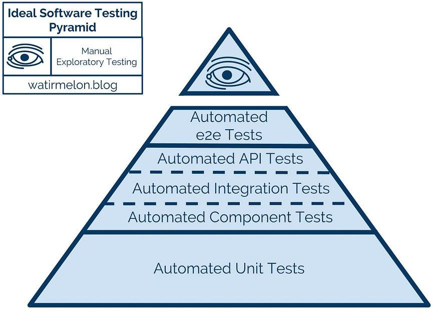

# Continuous Build and Delivery 
## AI Assisted Testing 20%

**Weighting**: 20%  
**Submission Type**: Individual  
**Application Context**: Spring Boot application  

## 1. Assignment Overview

The purpose of this assignment is to evaluate your ability to **design, generate, and 
critically evaluate automated tests using AI based tools and modern coding tools,**
within the context of a Spring Boot application. 

You are expected to use AI-based tools as collaborators in the testing process. Marks 
are awarded not for AI usage alone, but for **how effectively you direct, validate, and 
correct AI-generated test artefacts.**

This assignment focuses on: 

- testing strategy and test quality, 
- appropriate use of dependency injection and mocking, 
- critical evaluation of AI-generated tests, 
- and alignment with the Test Pyramid. 

#### CI/CD pipeline construction and deployment are not assessed in this assignment. 

## 2. Learning Objectives 

On successful completion of this assignment, you will be able to: 

1. Design a testing strategy aligned with the Test Pyramid. 
2. Use agentic AI tools to assist with test generation and test analysis. 
3. Evaluate AI-generated tests for correctness, brittleness, and architectural 
alignment. 
4. Apply dependency injection and mocking appropriately in Spring Boot tests. 
5. Demonstrate responsible and transparent use of AI in software testing. 

## 3. Application and Technology Constraints 

- The application under test **must be a Spring Boot application**. 
- Tests must be written in Java using appropriate frameworks (e.g. JUnit, Mockito, TestRestTemplate, Karate). 
- AI tools may include coding assistants, chat-based agents, or test-generation tools. 
- The choice of AI tool is not assessed; **how it is used is assessed**. 

## 4. Required Tasks 

### 4.1 AI-Assisted Test Development 

Develop a suite of automated tests that: 

- covers multiple levels of the Test Pyramid, 
- includes both AI-assisted and human-authored tests, 
- demonstrates intentional use of dependency injection and mocks. 

### 4.2 AI Interaction Log (Mandatory) 

You must submit an **AI Interaction Log** containing **exactly five examples**, structured 
as follows: 

#### Example 1: AI Output Accepted As-Is 

An example where AI-generated test code was accepted without modification. 
Include: 

- the prompt or task given to the AI, 
- the AI-generated output, 
- a brief justification explaining why the output was correct and appropriate. 

#### Example 2: AI Output Modified 

An example where AI-generated test code required modification. 

Include: 

- the original prompt, 
- the original AI output, 
- the final modified version, 
- an explanation of what was changed and why. 

#### Example 3: AI Output Rejected 

An example where AI-generated test code was rejected. 
Include: 

- the prompt, 
- the rejected output (excerpt is sufficient), 
- a clear technical justification for rejection (e.g. incorrect mocking, misuse of Spring context, brittle test design). 

#### Example 4: AI-Identified Gap or Improvement 

An example where AI was used to analyse the test suite and identify a missing test or 
weakness. 

Include: 

- the analysis prompt, 
- the AI’s suggestion, 
- the action taken (test added, refactored, or consciously rejected with justification). 

#### Example 5: AI Output Constrained by Explicit Rules 

An example where explicit architectural or testing constraints were imposed on the AI to 
control how tests were generated. 

You must include: 

- the prompt showing the constraint or rule given to the AI (e.g. prohibiting use of the Spring context, restricting mocking, enforcing constructor injection), 
- the AI-generated output produced under this constraint, 
- a brief explanation of: 
  - what behaviour was being prevented, 
  - why the constraint was necessary, 
  - how the constraint improved test quality, performance, or alignment with the Test Pyramid. 

### 4.3 Test Strategy, Dependency Injection, and Mocking 

###### Figure 1: Testing Pyramid 

In your report, describe: 

- how your test suite aligns with the Test Pyramid, 
- how dependency injection enables testability, 
- where mocks were used and why, 
- where mocks were avoided and why, 
- how AI influenced these decisions. 

### 4.4 Evaluation and Reflection 

Critically evaluate: 

- strengths and weaknesses of AI-generated tests (two strengths and two weaknesses – must be supported by examples) 
- at least one observed failure mode of AI (e.g. brittle tests, incorrect assumptions), 
- one example where human judgement improved test quality, 
- one improvement you would make to your AI-assisted testing approach. 

## 5. Deliverables 

You must submit: 

1. **Source Code** 
    - Application and test code (zip). 
2. **Report (PDF or Word)**  
  Must include:  
    - Test Strategy 
    - Dependency Injection and Mocking Approach 
    - Mapping to Test Pyramid (Brief explanation and list the tests at each level of pyramid) 
    - AI Interaction Log (Examples 1-5) 
    - Evaluation and Reflection 
3. **Screencast (Maximum 5 minutes, camera on)**  
  Demonstrating:  
    - Execution of the automated test suite, 
    - Visible test results. 
    - Inspection of a test coverage report 
4. **Repository Link**
    - Publicly accessible or accessible to the lecturer. 

## 6. Marking Rubric 

### 1. Test Suite Quality, Strategy, and Spring Usage (40%) 

Section 1, 2 and 3 in report and based on report and code. 

| Level | Criteria |
| ----- | -------- |	
| Excellent  (70%+) | Test suite is well-structured and intentionally designed across multiple   levels of the Test Pyramid. Dependency injection is used correctly to   enable testability. Mocking is applied appropriately and selectively, with  clear justification. Tests are meaningful, non-trivial, and correctly  scoped. AI-assisted tests demonstrate clear added value and are  guided by strong human judgement. Clear mapping to test pyramid. |
| Good  (55\-69%) | Test suite covers more than one test level with generally sound  structure. Dependency injection and mocking are mostly appropriate,  though some decisions lack clarity or depth of justification. Most tests  are useful but occasionally shallow or redundant. Purpose of tests at  each level not clear. |
| Satisfactory (40\–54%) | Test suite shows limited variety across test levels or inconsistent  structure. Use of dependency injection and mocking is uneven or  weakly justified. |
|Fail  (0\-39%) |	Test suite is minimal, poorly structured, or incorrectly implemented.  Misuse of Spring testing features, dependency injection, or mocks is  evident. Tests are trivial, brittle, or ineffective. No mapping to test  pyramid. |
 
### 2. AI Interaction Log (Five Examples) (40%) 

| Level | Criteria |
| ----- | -------- |
| Excellent  (70%+) | All five required examples are present, clearly differentiated, and well\- structured. h example includes appropriate prompts, outputs, and  strong technical justification. Clear evidence of acceptance,  modification, rejection, gap identification, and constraint of AI output.  Demonstrates high-quality critical judgement and control over AI  behaviour. |
| Good  (55\-69%) | All examples are present with mostly sound explanations. Minor gaps  in technical depth or clarity. Evidence of judgement is present but uneven  across examples. |
| Satisfactory (40\-54%) | Examples are present but explanations are largely descriptive rather   than analytical. Limited evidence of rejecting or constraining AI output.   Overlap between examples may be present. |
| Fail (0\-39%) | One or more examples missing, poorly structured, or inadequately   justified. AI usage is largely uncritical or insufficiently documented. |
 
### 3. Evaluation and Reflection (20%) 

| Level | Criteria |
| ----- | -------- |
| Excellent  (70%+) | Insightful and well-supported evaluation. Clearly identifies strengths  and weaknesses of AI-generated tests with concrete examples.  Demonstrates awareness of AI failure modes and the importance of  human intervention. Proposes a thoughtful and realistic improvement to  the AI-assisted testing approach. |
| Good  (55\-69%) | Evaluation addresses required points with some supporting examples.   Observations are valid but lack depth or synthesis. Improvement  proposed is reasonable but underdeveloped. |
| Satisfactory (40\-54%) | Evaluation is largely descriptive with limited analysis. Examples are  weak, generic, or insufficiently linked to the student’s own work. |
| Fail  (0\-39%) | Minimal or missing evaluation. Assertions unsupported by evidence.  Little or no reflection on AI limitations or learning. |
 
### 4. Screencast: Test Execution and Coverage Evidence (Pass/Fail – Required) 

To pass this component, the screencast must demonstrate: 

- execution of the automated test suite, 
- visible test results, 
- inspection of a test coverage report, 
- brief explanation of what the coverage indicates. 

Failure to demonstrate these elements may result in the submission being marked incomplete. 

Coverage is treated as evidence, not a target. 
 