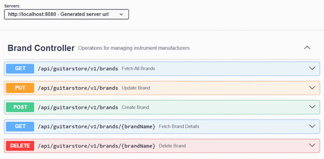

# 5. API Demonstration

| Method | Endpoint              | Description                             | Status Code |
| ------ | --------------------- | --------------------------------------- | ----------- |
| GET    | /guitars              | Fetch all guitars (supports pagination) | 200 OK      |
| GET    | /guitars/model/{name} | Fetch a specific guitar                 | 200 / 404   |
| POST   | /guitars              | Create a new guitar (validated)         | 201 Created |
| PUT    | /guitars              | Update guitar details                   | 200 OK      |
| DELETE | /guitars/{name}       | Remove a guitar                         | 200 / 204   |

## YouTube Demos

###### Guitars API Demo Video

###### Brands API Demo Video

## OpenAPI Documentation

[View Swagger UI API Docs](https://tus-26-ma-ca1-guitar-store-api.onrender.com/swagger-ui/index.html)