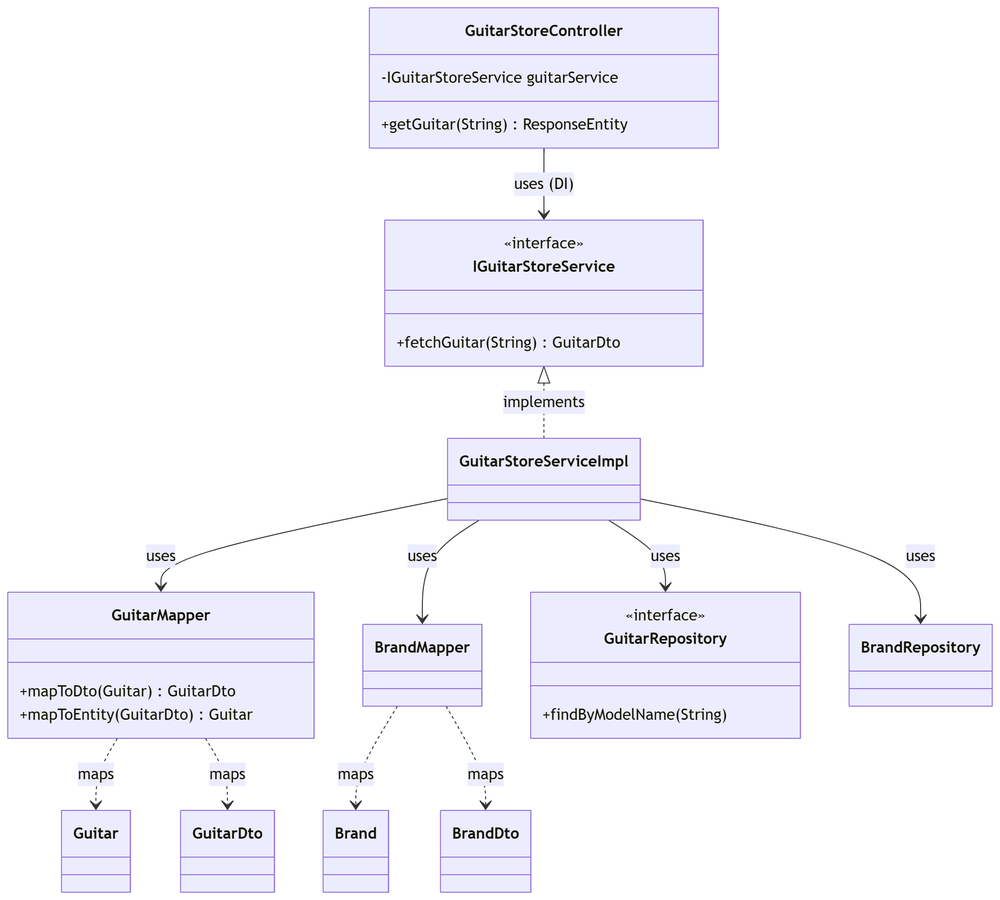
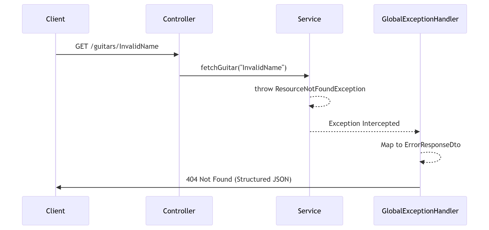

# 6. Diagrams

## Class Diagram

##### Guitar Store API Class Diagram

## System Architecture & Data Flow

This class diagram illustrates the API’s adherence to the Single Responsibility Principle through a strictly layered architecture.  

* **Controller Layer:** Handles RESTful request mapping and URI routing.
* **Service Layer:** Encapsulates business logic, managing the Brand and Guitar domains through specialized interfaces to ensure modularity.
* **Mapping Layer:** Utilizes BrandMapper and GuitarMapper to decouple internal JPA entities from external Data Transfer Objects (DTOs), preventing internal database details from leaking to the consumer.
* **Persistence Layer:** Leverages Spring Data JPA repositories to manage data access and maintain referential integrity with the H2 database.

##### API Sequence Diagram

## API Request-Response Lifecycle

This sequence diagram illustrates the end-to-end flow of a RESTful request within the system:  

* **Request Interception:** The Controller receives the HTTP request and utilizes @PathVariable or @RequestBody to extract data.
* **Business Logic Delegation:** The request is passed to the specialized Service layer (e.g., BrandService or GuitarService), ensuring a strict separation of concerns.
* **Persistence & Mapping:** The service interacts with the JPA Repository for data access and uses Mappers to convert internal entities into DTOs, maintaining a secure API contract.
* **Global Exception Handling:** If a resource is missing or data is invalid, the service layer throws a custom exception (e.g., ResourceNotFoundException).
* **Structured Response:** The GlobalExceptionHandler intercepts the error and transforms it into a standardized ErrorResponseDto, ensuring the client receives consistent JSON feedback instead of a raw stack trace