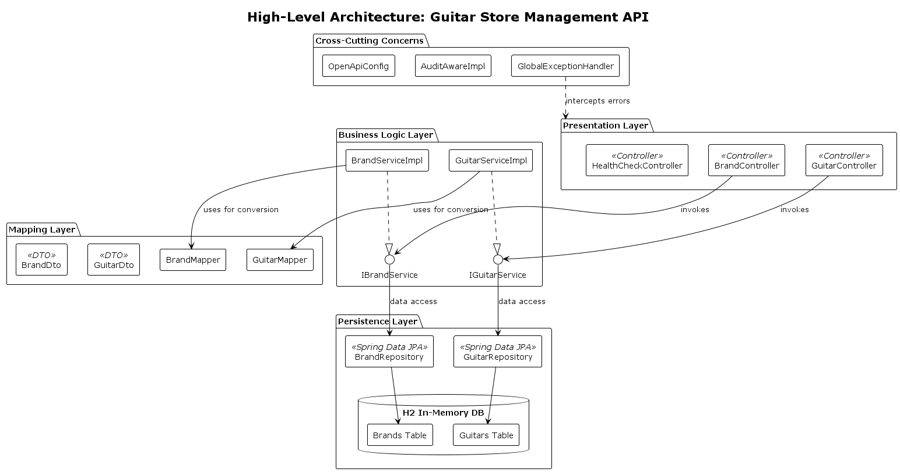
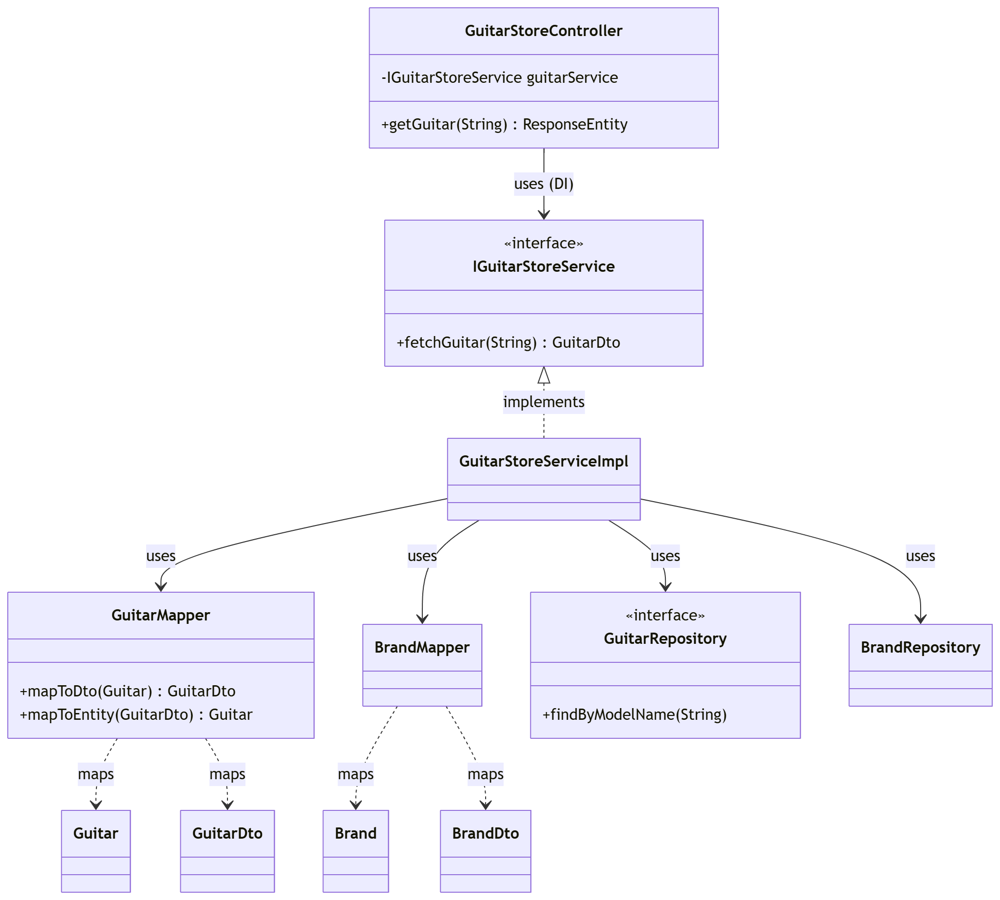
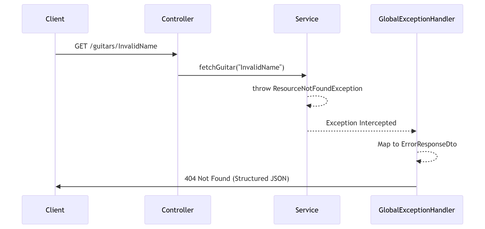
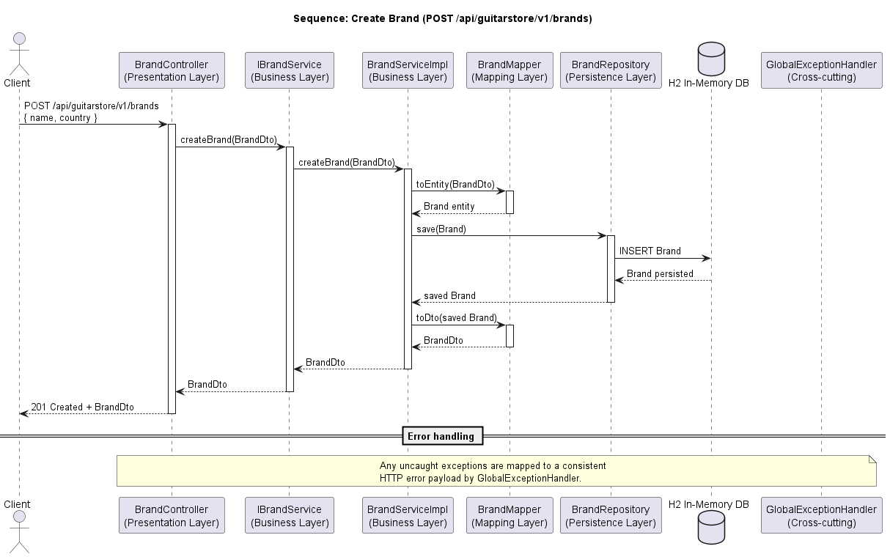
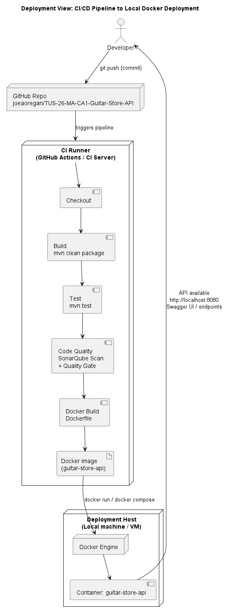

# 6. Diagrams

## High-Level Architecture Diagram

    Figure 1. High-Level Architecture Diagram

## Class Diagram

    Figure 2. Guitar Store API Class Diagram

## System Architecture & Data Flow

This class diagram illustrates the API’s adherence to the Single Responsibility Principle through a strictly layered architecture.  

* **Controller Layer:** Handles RESTful request mapping and URI routing.
* **Service Layer:** Encapsulates business logic, managing the Brand and Guitar domains through specialized interfaces to ensure modularity.
* **Mapping Layer:** Utilizes BrandMapper and GuitarMapper to decouple internal JPA entities from external Data Transfer Objects (DTOs), preventing internal database details from leaking to the consumer.
* **Persistence Layer:** Leverages Spring Data JPA repositories to manage data access and maintain referential integrity with the H2 database.

    Figure 3. Guitar Store API Sequence Diagram

## API Request-Response Lifecycle

This sequence diagram illustrates the end-to-end flow of a RESTful request within the system:  

* **Request Interception:** The Controller receives the HTTP request and utilizes @PathVariable or @RequestBody to extract data.
* **Business Logic Delegation:** The request is passed to the specialized Service layer (e.g., BrandService or GuitarService), ensuring a strict separation of concerns.
* **Persistence & Mapping:** The service interacts with the JPA Repository for data access and uses Mappers to convert internal entities into DTOs, maintaining a secure API contract.
* **Global Exception Handling:** If a resource is missing or data is invalid, the service layer throws a custom exception (e.g., ResourceNotFoundException).
* **Structured Response:** The GlobalExceptionHandler intercepts the error and transforms it into a standardized ErrorResponseDto, ensuring the client receives consistent JSON feedback instead of a raw stack trace

## Sequence Diagram (Create Brand)

    Figure 4. Sequence Diagram – Create Brand (POST /api/guitarstore/v1/brands)

This sequence diagram focuses on the “create brand” use case and shows how a request travels through the layered architecture. The `BrandController` receives the HTTP POST request, delegates to the service layer (`IBrandService` / `BrandServiceImpl`), and the service persists the new brand via `BrandRepository` (Spring Data JPA) backed by the H2 in-memory database. DTO-to-entity conversion is handled by `BrandMapper`, and any exceptions are converted into consistent API error responses by the `GlobalExceptionHandler`.

## Deployment / CI-CD Architecture (Pipeline View)

    Figure 5. CI/CD Deployment View (GitHub → Build/Test → Quality Gate → Docker → Local Deployment)

This deployment view links the application architecture to the CI/CD requirements of the assignment. A commit pushed to GitHub triggers the pipeline, which builds the Maven artefact, runs automated tests, executes static analysis (SonarQube) and enforces a quality gate. Only when these stages pass does the pipeline build a Docker image and deploy the container to a local runtime, ensuring failed stages prevent deployment.