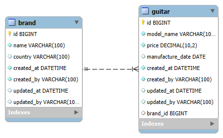

# 7. Database and Audit

- **Access H2 Console:** https://localhost:8080/h2-console (using the JDBC URL specified in `application.yml`)
- **Auditing:** Automated metadata tracking via `BaseEntity` and `JpaAuditAware`
- **Relationship:** Demonstrates a One-to-Many relationship between `Brands` and `Guitars` with Cascading Deletes.

##### Entity Relationship Diagram