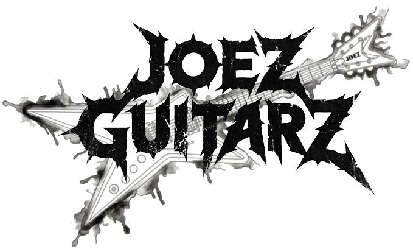

# Guitar Store API Documentation

## Guitar Store REST API

**Student Name:** [Joe O'Regan](https://github.com/joeaoregan)  
**Student Number:** A00258304

## Contents

- [Home](index.md)
- [Microservices Architecture CA1](microservices-architecture-ca1/index.md)
- [Continuous Build and Delivery CA1](continuous-build-and-delivery-ca1/index.md)
- [Continuous Build and Delivery CA2](continuous-build-and-delivery-ca2/index.md)
- Guide:  
    1 [How to Run](guide/index.md)  
    2 [Project Overview](guide/2_project_overview.md)  
    3 [Core Technology Requirements](guide/3_core_tech.md)  
    4 [Technology Stack](guide/4_tech_stack.md)  
    5 [API Demonstration](guide/5_api_demo.md)  
    6 [Diagrams](guide/6_diagrams.md)  
    7 [Database and Audit](guide/7_database.md)  
    8 [Status Codes implemented](guide/8_status_codes.md)  
    9 [API Endpoints](guide/9_end_points.md)
- [Testing](testing/index.md)
    - [Unit Tests](testing/unit-tests/index.md)
    - [Integration Tests](testing/integration-tests/index.md)
    - [End-to-End(E2E) / API Tests](testing/end-to-end-tests/index.md)
- [Links](links/index.md)

## Application

- [View App on Render](https://tus-26-ma-ca1-guitar-store-api.onrender.com/)
- [View Swagger UI API Docs](https://tus-26-ma-ca1-guitar-store-api.onrender.com/swagger-ui/index.html)
- [Online Documentation](https://joeaoregan.github.io/TUS-26-MA-CA1-Guitar-Store-API/)

## Demonstration

<iframe width="480" height="270" src="https://www.youtube.com/embed/VXFKyfw5zmo" title="Guitar Strore API - Guitars Demo" frameborder="0" allow="accelerometer; autoplay; clipboard-write; encrypted-media; gyroscope; picture-in-picture; web-share" referrerpolicy="strict-origin-when-cross-origin" allowfullscreen></iframe>

###### Guitars API Demo Video

<iframe width="480" height="270" src="https://www.youtube.com/embed/z5adidLxAFg" title="Guitar Store API - Brands Demo" frameborder="0" allow="accelerometer; autoplay; clipboard-write; encrypted-media; gyroscope; picture-in-picture; web-share" referrerpolicy="strict-origin-when-cross-origin" allowfullscreen></iframe>

###### Brands API Demo Video

<iframe width="480" height="270" src="https://www.youtube.com/embed/jyT-ziHCOLA" title="Continuous Build &amp; Delivery CA1" frameborder="0" allow="accelerometer; autoplay; clipboard-write; encrypted-media; gyroscope; picture-in-picture; web-share" referrerpolicy="strict-origin-when-cross-origin" allowfullscreen></iframe>

###### AI Assisted Testing, Coverage, and Reports Demo Video

## Information

Technological University of the Shannon  

- Microservices Architecture CA1: Development and Deployment of a REST API
- Continuous Build and Delivery CA1: AI Assisted Testing