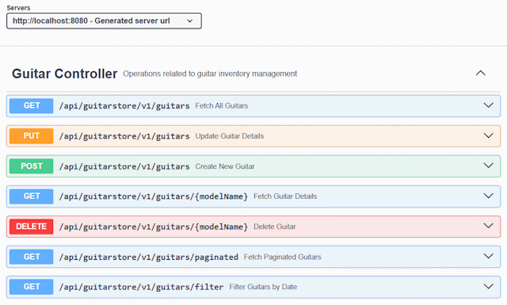

# Links

## GitHub Repository

- <https://github.com/joeaoregan/TUS-26-MA-CA1-Guitar-Store-API>

## Branches

- **Microservices Architecture CA1:** [ma-ca1](https://github.com/joeaoregan/TUS-26-MA-CA1-Guitar-Store-API/tree/ma-ca1)
- **Continuous Build and Delivery CA1:** [cbd-ca1](https://github.com/joeaoregan/TUS-26-MA-CA1-Guitar-Store-API/tree/cbd-ca1)

## Render Deployment

- [View App](https://tus-26-ma-ca1-guitar-store-api.onrender.com/)
- [View Swagger UI API Docs](https://tus-26-ma-ca1-guitar-store-api.onrender.com/swagger-ui/index.html)

## YouTube Demos

###### Guitars API Demo Video

###### Brands API Demo Video

###### AI Assisted Testing, Coverage, and Reports Demo Video

## Online MkDocs Documentation

- <https://joeaoregan.github.io/TUS-26-MA-CA1-Guitar-Store-API/>