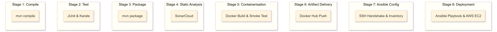
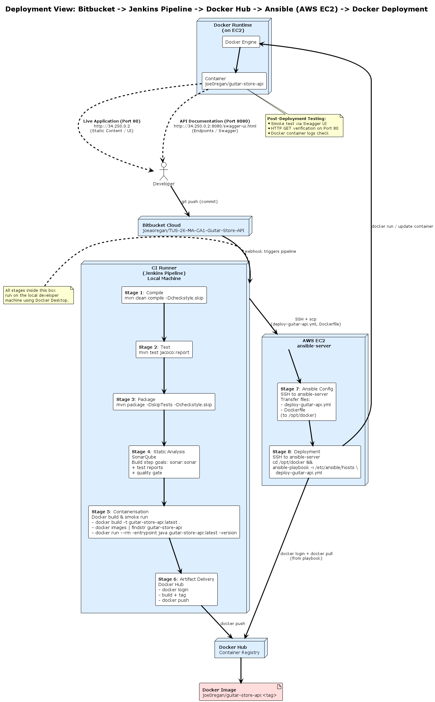
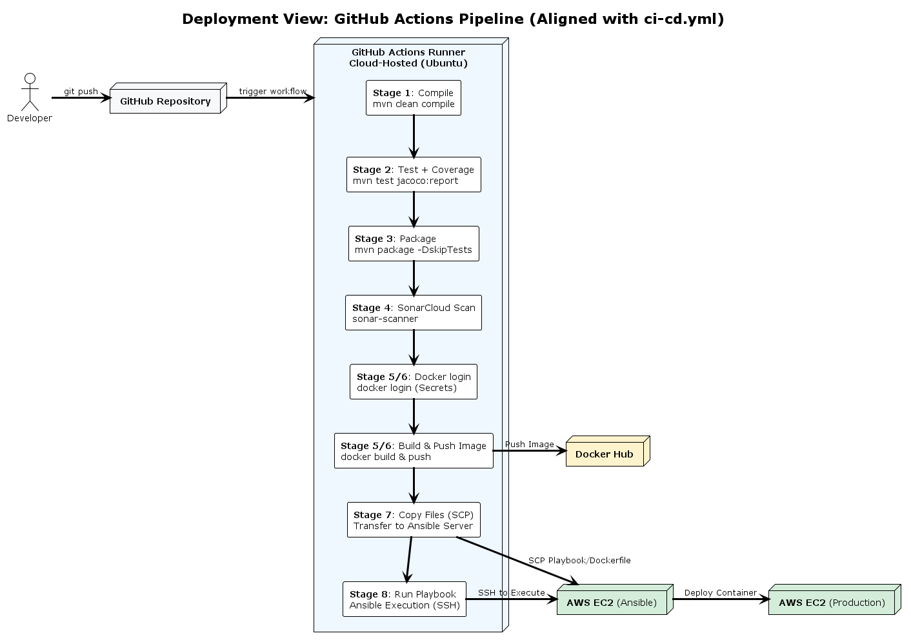

# CI/CD Pipeline Architecture

## The Pipeline 

    Figure 1. Build Pipeline

The pipeline is architected into eight distinct stages to provide clear separation of concerns. This ensures that if a build fails during Stage 4 (Static Analysis), the subsequent containerisation and deployment stages are blocked, preserving the integrity of the production environment.

## 🚀 CI/CD Pipeline

This project utilizes a fully automated **Declarative Jenkins Pipeline** to manage the lifecycle of the Guitar Store API.

| Status | Stage | Description |
| :--- | :--- | :--- |
| ✅ | **CI** | Maven Build, JUnit Testing, & SonarCloud Analysis |
| ✅ | **CD** | Docker Hub Delivery & Ansible Orchestration |
| 🌐 | **Live** | Automated Deployment to AWS EC2 |

## Pipeline Stages

### Stage 1: Compile (Bitbucket & Maven)
Jenkins monitors the [Bitbucket repository](https://bitbucket.org/joeaoregan/cbd-ca2-guitarstoreapi-pipeline) and pulls the latest source code from the cbd-ca2 branch upon detecting a commit. Maven then validates the project structure and compiles the Java 21 source code to ensure the application is syntactically correct before testing.  

**Configuration**: Source Code Management (SCM) uses the Bitbucket repository URL with the branch specifier `*/cbd-ca2`.  

### Stage 2: Test (JUnit & Karate)
The pipeline executes a suite of 43 automated tests, including JUnit for internal business logic and Karate for BDD-style API integration. The pipeline is configured with a "fail-fast" logic; if any test fails, the build stops immediately to prevent broken code from reaching production.  

**Configuration**: Maven goal `mvn test` is used, with results parsed by the Jenkins JUnit plugin from the target/surefire-reports directory.  

### Stage 3: Package (Maven)
Once verified by tests, Maven packages the compiled code into a single, executable .jar file. This creates a portable artifact containing the entire Spring Boot application, ready for containerisation.  

**Configuration**: The `mvn package -DskipTests -Dcheckstyle.skip` command generates guitar-store-api-0.0.1-SNAPSHOT.jar in the target folder.  

### Stage 4: Static Analysis (SonarCloud & Checkstyle)
This stage implements Continuous Inspection by triggering a SonarScanner process. The code is uploaded to [SonarCloud](https://sonarcloud.io/project/overview?id=tus-26-ma-ca1-guitar-store-api) to check for bugs, vulnerabilities, and "code smells," while Checkstyle enforces strict formatting standards.  

**Configuration**: Uses the `sonar:sonar` goal with a secure authentication token stored in Jenkins Credentials.  

### Stage 5: Containerisation (Docker)
A multi-stage Docker build packages the JAR into a slim, production-ready image using a JRE-only base to minimize the security attack surface. A trial run is performed within the pipeline as a "smoke test" to ensure the container is responsive before delivery.  

**Configuration**: Executes a batch command: `docker build -t joe0regan/guitar-store-api:latest .`.  

### Stage 6: Artifact Delivery (Docker Hub)
The verified Docker image is tagged and pushed to a central repository on [Docker Hub](https://hub.docker.com/r/joe0regan/guitar-store-api/tags). This transforms the image into an immutable artifact that can be pulled by any authorized server in the network.  

**Configuration**: Uses `docker login` with masked Jenkins credentials (`DOCKER_USER`, `DOCKER_PASS`) followed by `docker push`.  

### Stage 7: Ansible Configuration
Jenkins securely transmits the deployment blueprints—specifically the Ansible Playbook (deploy-guitar-api.yml) and the Dockerfile—to the Ansible Control Node via SSH. This decouples the build environment from the deployment orchestration logic.  

**Configuration**: The "Publish over SSH" plugin transfers files to `/opt/docker` on the Ansible EC2 instance using the ansadmin service user.  

### Stage 8: Deployment (AWS EC2)
The final stage triggers the automated deployment on the target AWS Docker Host. Jenkins sends a remote command to Ansible, which executes a "Stop, Remove, Pull, and Run" sequence to ensure the latest version of the API is live on `port 8080`.  

**Configuration**: Exec command: `ansible-playbook -i /etc/ansible/hosts /opt/docker/deploy-guitar-api.yml`.

## Detailed Diagram

### Jenkins Pipeline

    Figure 2. Detailed Jenkins Pipeline Diagram

### GitHub Actions Pipeline

    Figure 3. Detailed GitHub Actions Pipeline Diagram